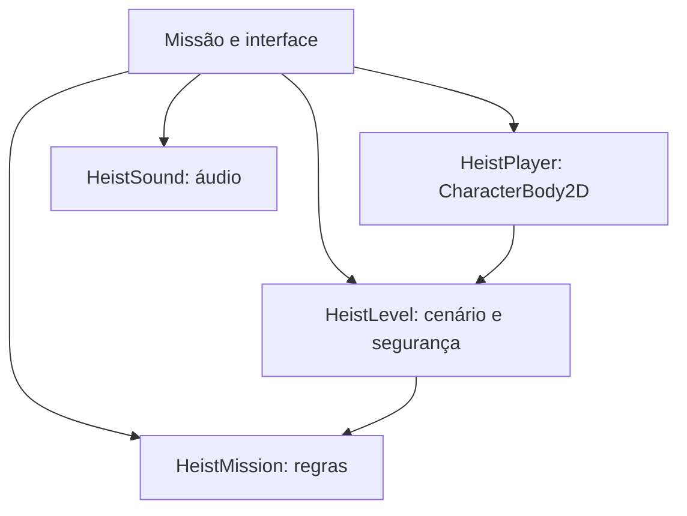

# Night Heist — MVP jogável 0.2.0

Especificação: GDD Night Heist Escape Phase V2, versão 0.2, páginas 1–7, fornecido pelo usuário.

## Loop e decisões de implementação

Iniciar → acionar botão térreo → arrombar porta → subir à direita → acionar botão do primeiro andar → subir à esquerda → arrombar segunda porta → atravessar lasers / usar terminal → subir à direita → saquear cofre à esquerda → retornar ao spawn verde.

| Regra | Fonte | Implementação do MVP |
|---|---|---|
| Quatro pavimentos | GDD §2, p.2 | Entrada, vigilância, lasers, cofre |
| Contagem na entrada | GDD M-01, p.3 | 180 s após iniciar a infiltração; menu não conta |
| Skill check | GDD M-02, p.3 | Ponteiro triangular; zona verde 40–62%; erro bloqueia 2 s |
| Câmeras | GDD M-03, p.3 | Cone oscilante; >0,5 s contínuo dispara alerta |
| Lasers | GDD M-03, p.3 | Um diagonal e outro baixo; ciclo 2 s ativo / 1,5 s desligado |
| Switches | GDD M-04, p.3 | Liberam acesso às escadas / alçapões dos andares 0 e 1 |
| Parkour | GDD M-05, p.3 | Corrida, salto, agachamento e subida/descida de escadas |
| Fuga | GDD REQ-05, p.7 | Cofre coletado + distância <30 px do spawn + tempo >0 |
| Arte / som | GDD REQ-06, p.7 | Sprite 32×32, cenário nativo estilizado e áudio original |

Os valores de 180 s, penalidade de 8 s com cooldown de 3 s, terminal de 12 s e tolerância de 30 px são decisões de balanceamento deste MVP: o GDD não define esses números. Alarme não encerra imediatamente a missão; desconta tempo. Toda derrota ocorre por timeout. O saque secundário vale 250 por item e o cofre 5000. Não há grade descendente.

## Plataformas e controles

Teclado: A/D ou setas horizontais, W/S ou setas verticais para escadas, Espaço para pular, Shift para correr, C para agachar, E para interagir/confirmar, Esc para pausar, R para reiniciar.

Touch: botões nativos TouchScreenButton permitem movimento e salto simultâneos; interação possui feedback e callback próprio. Landscape 1280×720 com proporção preservada; barras podem aparecer em telas com outra proporção. Testes Android em aparelho real continuam necessários.

## Arquitetura

A lógica usa sinais, Callable, Geometry2D, InputMap e operações nativas de coleções; condições imperativas permanecem em transições, callbacks de física e validação de sensores, onde representam decisões reais. A geração PCM requer escrita indexada: não existe operação de alto nível que gere diretamente a forma de onda escolhida. Os arrays pequenos de portas e sensores tornam as buscas O(n); não existem buscas no cenário inteiro a cada frame.

## Limites

Uma fase completa do MVP; sem campanha, personagens adversários, monetização, ranking online ou conteúdo não descrito no GDD. Arte original de baixa resolução e iluminação simulada por polígonos, sem promessa de polimento final. A versão distribuída continua sendo APK de testes com assinatura debug.

## Fontes técnicas

- Godot 4.4, CharacterBody2D: https://docs.godotengine.org/en/4.4/classes/class_characterbody2d.html
- Godot 4.4, Geometry2D: https://docs.godotengine.org/en/4.4/classes/class_geometry2d.html
- Godot 4.4, TouchScreenButton: https://docs.godotengine.org/en/4.4/classes/class_touchscreenbutton.html
- Godot 4.4, AudioStreamWAV: https://docs.godotengine.org/en/4.4/classes/class_audiostreamwav.html
